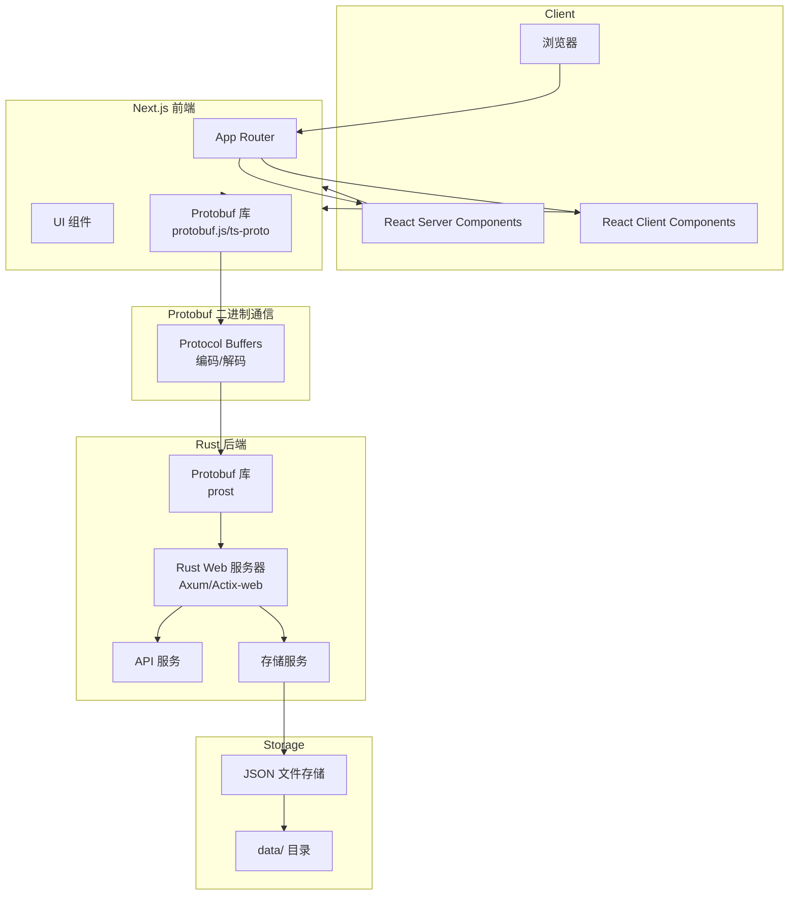
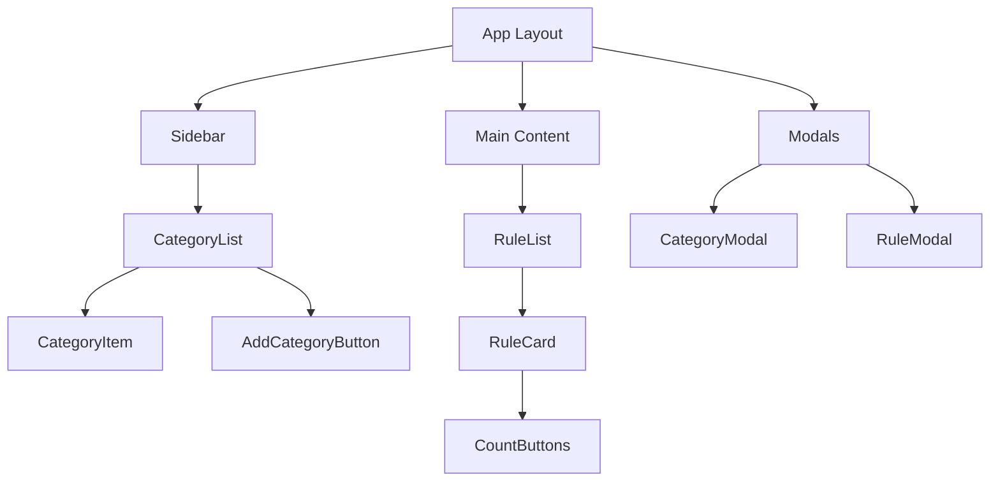

# 个人宪法 - Next.js 前端 + Rust 后端架构开发文档

## 1. 项目概述

"个人宪法"是一个参考 Claude 宪法式 AI 思想的 Web 应用，目标是帮助用户为日常生活制定"宪法"规则，并追踪规则的遵守情况。

### 核心功能
- 规则分类管理：用户可创建分类（如"学习"、"工作"、"朋友"等）
- 规则管理：创建、编辑、删除规则，并关联到分类
- 规则计数功能：记录每条规则被遵守/违反的次数

## 2. 技术架构

### Next.js 前端 + Rust 后端架构



### 技术栈

| 层级 | 技术 | 版本 |
|------|------|------|
| 前端框架 | Next.js | 16.x |
| 前端 | React | 19.x |
| 构建工具 | Next.js App Router | - |
| 语言 | TypeScript | 5.x |
| 样式 | Tailwind CSS | 4.x |
| Protobuf 前端库 | protobuf.js 或 ts-proto | 最新版 |
| 后端 | Rust | 1.80+ |
| 后端框架 | Axum/Actix-web | 最新版 |
| Protobuf 后端库 | prost | 最新版 |
| 通信协议 | Protocol Buffers | - |
| 数据存储 | JSON 文件 | - |

## 3. 目录结构

```
personal-constitution-web/
├── app/                      # Next.js 前端目录 (移除 API 路由)
│   ├── components/           # React 组件
│   │   ├── common/           # 通用组件
│   │   ├── category/         # 分类相关组件
│   │   └── rule/             # 规则相关组件
│   ├── lib/                  # 工具函数和 API 客户端
│   ├── types/                # TypeScript 类型定义
│   ├── globals.css           # 全局样式
│   ├── layout.tsx            # 根布局
│   └── page.tsx              # 首页
├── api/                      # Rust 后端项目目录
│   ├── Cargo.toml            # Rust 项目配置
│   ├── src/
│   │   ├── main.rs           # 主入口文件
│   │   ├── handlers/         # API 处理器
│   │   ├── models/           # 数据模型
│   │   ├── storage/          # 存储层实现
│   │   └── routes/           # 路由定义
├── proto/                    # Protobuf 定义文件目录
│   ├── category.proto        # 分类消息定义
│   ├── rule.proto            # 规则消息定义
│   └── count_record.proto    # 计数记录消息定义
├── data/                     # JSON 数据存储目录 (由 Rust 后端管理)
│   ├── categories.json       # 分类数据
│   ├── rules.json            # 规则数据
│   └── count-records.json    # 计数记录数据
├── docs/                     # 文档目录
├── public/                   # 静态资源
├── package.json              # 项目依赖配置
└── next.config.ts            # Next.js 配置
```

## 4. 数据模型设计

### TypeScript 接口定义

```typescript
// types/index.ts
interface Category {
  id: string;
  name: string;
  createdAt: Date;
  updatedAt: Date;
}

interface Rule {
  id: string;
  categoryId: string;
  content: string;
  followCount: number;
  violateCount: number;
  createdAt: Date;
  updatedAt: Date;
}

interface CountRecord {
  id: string;
  ruleId: string;
  type: 'follow' | 'violate';
  timestamp: Date;
  note?: string;
}
```

### JSON 文件结构示例

```json
// data/categories.json
[
  {
    "id": "cat1",
    "name": "学习",
    "createdAt": "2025-01-01T00:00:00.000Z",
    "updatedAt": "2025-01-01T00:00:00.000Z"
  },
  {
    "id": "cat2",
    "name": "工作",
    "createdAt": "2025-01-01T00:00:00.000Z",
    "updatedAt": "2025-01-01T00:00:00.000Z"
  }
]

// data/rules.json
[
  {
    "id": "rule1",
    "categoryId": "cat1",
    "content": "每天学习1小时",
    "followCount": 5,
    "violateCount": 1,
    "createdAt": "2025-01-01T00:00:00.000Z",
    "updatedAt": "2025-01-05T00:00:00.000Z"
  }
]

// data/count-records.json
[
  {
    "id": "record1",
    "ruleId": "rule1",
    "type": "follow",
    "timestamp": "2025-01-05T08:00:00.000Z",
    "note": "早上完成了学习计划"
  }
]
```

## 5. Protobuf 通信协议

### 为什么使用 Protobuf

- **类型一致性**：前后端共享 .proto 定义，确保数据结构一致
- **传输效率**：二进制格式比 JSON 更紧凑，减少网络传输量
- **性能优势**：序列化/反序列化速度快，适合高频通信
- **版本兼容性**：支持向前/向后兼容，便于迭代升级

### Protobuf 消息定义示例

```protobuf
// proto/category.proto
syntax = "proto3";

package constitution;

message Category {
  string id = 1;
  string name = 2;
  string created_at = 3;
  string updated_at = 4;
}

message CategoryList {
  repeated Category categories = 1;
}

message CreateCategoryRequest {
  string name = 1;
}
```

```protobuf
// proto/rule.proto
syntax = "proto3";

package constitution;

message Rule {
  string id = 1;
  string category_id = 2;
  string content = 3;
  uint32 follow_count = 4;
  uint32 violate_count = 5;
  string created_at = 6;
  string updated_at = 7;
}

message RuleList {
  repeated Rule rules = 1;
}

message CreateRuleRequest {
  string category_id = 1;
  string content = 2;
}
```

```protobuf
// proto/count_record.proto
syntax = "proto3";

package constitution;

message CountRecord {
  string id = 1;
  string rule_id = 2;
  string type = 3;  // 'follow' 或 'violate'
  string timestamp = 4;
  string note = 5;
}

message CountRecordList {
  repeated CountRecord records = 1;
}
```

### 前端代码生成

使用 `protobuf.js` 或 `ts-proto` 生成 TypeScript 代码：

```bash
# 使用 protobuf.js
pbjs -t static-module -w commonjs -o app/lib/proto/generated.js proto/*.proto
pbts -o app/lib/proto/generated.d.ts app/lib/proto/generated.js

# 或使用 ts-proto
protoc --ts_proto_out=./app/lib/proto proto/*.proto
```

### 后端代码生成

使用 `prost` 在 Rust 中生成代码。在 `api/Cargo.toml` 中配置：

```toml
[dependencies]
prost = "0.12"
tokio = { version = "1", features = ["full"] }
axum = "0.7"

[build-dependencies]
prost-build = "0.12"
```

在 `api/build.rs` 中：

```rust
use prost_build::Config;

fn main() {
    Config::new()
        .compile_protos(&["../proto/category.proto", "../proto/rule.proto", "../proto/count_record.proto"], &["../proto"])
        .unwrap();
}
```

### 请求/响应示例

**前端发送 Protobuf 请求：**

```typescript
// app/lib/api-client.ts
import { Category, CreateCategoryRequest } from './proto/generated';

const API_BASE_URL = process.env.NEXT_PUBLIC_API_URL || 'http://localhost:8080';

export async function createCategory(name: string): Promise<Category> {
  const request = CreateCategoryRequest.create({ name });
  const buffer = CreateCategoryRequest.encode(request).finish();
  
  const response = await fetch(`${API_BASE_URL}/api/categories`, {
    method: 'POST',
    headers: {
      'Content-Type': 'application/x-protobuf',
    },
    body: buffer,
  });
  
  if (!response.ok) {
    throw new Error('Failed to create category');
  }
  
  const arrayBuffer = await response.arrayBuffer();
  return Category.decode(new Uint8Array(arrayBuffer));
}

export async function fetchCategories(): Promise<Category[]> {
  const response = await fetch(`${API_BASE_URL}/api/categories`, {
    headers: {
      'Accept': 'application/x-protobuf',
    },
  });
  
  if (!response.ok) {
    throw new Error('Failed to fetch categories');
  }
  
  const arrayBuffer = await response.arrayBuffer();
  const categoryList = CategoryList.decode(new Uint8Array(arrayBuffer));
  return categoryList.categories;
}
```

**后端处理 Protobuf 请求：**

```rust
// api/src/handlers/category.rs
use axum::{
    extract::Json,
    http::StatusCode,
    response::IntoResponse,
};
use prost::Message;

pub async fn create_category(body: Vec<u8>) -> impl IntoResponse {
    match constitution::CreateCategoryRequest::decode(&body[..]) {
        Ok(request) => {
            let category = constitution::Category {
                id: uuid::Uuid::new_v4().to_string(),
                name: request.name,
                created_at: chrono::Utc::now().to_rfc3339(),
                updated_at: chrono::Utc::now().to_rfc3339(),
            };
            
            let encoded = category.encode_to_vec();
            (StatusCode::CREATED, encoded)
        }
        Err(_) => (StatusCode::BAD_REQUEST, vec![]),
    }
}

pub async fn get_categories() -> impl IntoResponse {
    let categories = vec![
        constitution::Category {
            id: "cat1".to_string(),
            name: "学习".to_string(),
            created_at: "2025-01-01T00:00:00Z".to_string(),
            updated_at: "2025-01-01T00:00:00Z".to_string(),
        },
    ];
    
    let category_list = constitution::CategoryList { categories };
    let encoded = category_list.encode_to_vec();
    
    (
        StatusCode::OK,
        [(axum::http::header::CONTENT_TYPE, "application/x-protobuf")],
        encoded,
    )
}
```

## 6. API 接口设计

所有 API 接口由 Rust 后端提供，Next.js 前端通过 HTTP 请求与后端通信。请求体和响应体使用 Protobuf 二进制格式，Content-Type 为 `application/x-protobuf`。

### 分类 API

#### 获取所有分类
- **方法**: `GET`
- **路径**: `/api/categories`
- **响应**: `CategoryList` (Protobuf 二进制格式)
- **Content-Type**: `application/x-protobuf`

#### 创建分类
- **方法**: `POST`
- **路径**: `/api/categories`
- **请求体**: `CreateCategoryRequest` (Protobuf 二进制格式)
- **响应**: `Category` (Protobuf 二进制格式)
- **Content-Type**: `application/x-protobuf`

#### 更新分类
- **方法**: `PUT`
- **路径**: `/api/categories/{id}`
- **请求体**: `CreateCategoryRequest` (Protobuf 二进制格式)
- **响应**: `Category` (Protobuf 二进制格式)
- **Content-Type**: `application/x-protobuf`

#### 删除分类
- **方法**: `DELETE`
- **路径**: `/api/categories/{id}`
- **响应**: `{ success: boolean }`

### 规则 API

#### 获取所有规则（可按分类筛选）
- **方法**: `GET`
- **路径**: `/api/rules?categoryId={categoryId}`
- **响应**: `RuleList` (Protobuf 二进制格式)
- **Content-Type**: `application/x-protobuf`

#### 创建规则
- **方法**: `POST`
- **路径**: `/api/rules`
- **请求体**: `CreateRuleRequest` (Protobuf 二进制格式)
- **响应**: `Rule` (Protobuf 二进制格式)
- **Content-Type**: `application/x-protobuf`

#### 更新规则
- **方法**: `PUT`
- **路径**: `/api/rules/{id}`
- **请求体**: `CreateRuleRequest` (Protobuf 二进制格式)
- **响应**: `Rule` (Protobuf 二进制格式)
- **Content-Type**: `application/x-protobuf`

#### 删除规则
- **方法**: `DELETE`
- **路径**: `/api/rules/{id}`
- **响应**: `{ success: boolean }`

### 计数 API

#### 增加遵守计数
- **方法**: `POST`
- **路径**: `/api/rules/{id}/follow`
- **响应**: `{ success: boolean, rule: Rule }`

#### 增加违反计数
- **方法**: `POST`
- **路径**: `/api/rules/{id}/violate`
- **响应**: `{ success: boolean, rule: Rule }`

## 7. 组件设计

### 组件层级结构



### 核心组件说明

| 组件名 | 职责 | Props |
|--------|------|-------|
| `CategoryList` | 展示分类列表 | `categories`, `selectedCategoryId`, `onSelect`, `onEdit`, `onDelete` |
| `CategoryItem` | 单个分类项 | `category`, `isActive`, `onClick`, `onEdit`, `onDelete` |
| `RuleList` | 展示规则列表 | `rules`, `onEdit`, `onDelete`, `onCount` |
| `RuleCard` | 单条规则卡片 | `rule`, `onFollow`, `onViolate` |
| `CountButtons` | 遵守/违反按钮 | `followCount`, `violateCount`, `onFollow`, `onViolate` |
| `CategoryModal` | 分类创建/编辑弹窗 | `isOpen`, `category?`, `onSave`, `onClose` |
| `RuleModal` | 规则创建/编辑弹窗 | `isOpen`, `rule?`, `categories`, `onSave`, `onClose` |

## 8. 状态管理

### 推荐方案：Next.js 前端 + Rust 后端架构

- Next.js 前端通过 HTTP API 与 Rust 后端通信
- 在需要数据获取的组件中使用 Client Components 和 SWR 或 React Query 进行数据获取和缓存
- 对于静态内容可使用 Server Components，但对于此应用主要是动态数据，主要使用 Client Components

### 示例 API 客户端组件

```tsx
// app/lib/api-client.ts
const API_BASE_URL = process.env.NEXT_PUBLIC_API_URL || 'http://localhost:8080';

export async function fetchCategories() {
  const response = await fetch(`${API_BASE_URL}/api/categories`);
  if (!response.ok) {
    throw new Error('Failed to fetch categories');
  }
  return response.json();
}

export async function createCategory(name: string) {
  const response = await fetch(`${API_BASE_URL}/api/categories`, {
    method: 'POST',
    headers: {
      'Content-Type': 'application/json',
    },
    body: JSON.stringify({ name }),
  });
  if (!response.ok) {
    throw new Error('Failed to create category');
  }
  return response.json();
}

export async function incrementFollow(ruleId: string) {
  const response = await fetch(`${API_BASE_URL}/api/rules/${ruleId}/follow`, {
    method: 'POST',
  });
  if (!response.ok) {
    throw new Error('Failed to increment follow count');
  }
  return response.json();
}

export async function incrementViolate(ruleId: string) {
  const response = await fetch(`${API_BASE_URL}/api/rules/${ruleId}/violate`, {
    method: 'POST',
  });
  if (!response.ok) {
    throw new Error('Failed to increment violate count');
  }
  return response.json();
}
```

### 示例 Client Component

```tsx
// app/components/rule/CountButtons.tsx
'use client';

import { incrementFollow, incrementViolate } from '@/lib/api-client';
import { useState } from 'react';

export function CountButtons({
  ruleId,
  followCount,
  violateCount,
  onCountUpdate  // 回调函数，用于更新父组件状态
}: {
  ruleId: string;
  followCount: number;
  violateCount: number;
  onCountUpdate: () => void;
}) {
  const [localFollowCount, setLocalFollowCount] = useState(followCount);
  const [localViolateCount, setLocalViolateCount] = useState(violateCount);

  const handleFollow = async () => {
    try {
      await incrementFollow(ruleId);
      setLocalFollowCount(prev => prev + 1);
      onCountUpdate(); // 通知父组件更新数据
    } catch (error) {
      console.error('Failed to increment follow count:', error);
    }
  };

  const handleViolate = async () => {
    try {
      await incrementViolate(ruleId);
      setLocalViolateCount(prev => prev + 1);
      onCountUpdate(); // 通知父组件更新数据
    } catch (error) {
      console.error('Failed to increment violate count:', error);
    }
  };

  return (
    <div className="count-buttons">
      <button onClick={handleFollow}>遵守 ({localFollowCount})</button>
      <button onClick={handleViolate}>违反 ({localViolateCount})</button>
    </div>
  );
}
```

## 9. 开发环境配置

### 前置要求

- Node.js >= 18
- Rust (rustc >= 1.80, cargo)
- pnpm（推荐）或 npm
- protoc >= 3.0（Protocol Buffers 编译器）

### 安装步骤

```bash
# 1. 克隆项目
git clone <repository-url>
cd personal-constitution-web

# 2. 安装前端依赖
pnpm install

# 3. 安装 Protobuf 编译器（macOS）
brew install protobuf

# 或在 Linux 上
sudo apt-get install protobuf-compiler

# 4. 生成 Protobuf 代码
# 前端代码生成
pnpm proto:generate

# 后端代码生成（在 api 目录下）
cd api
cargo build  # 这将通过 build.rs 自动生成 Protobuf 代码
cd ..

# 5. 启动开发环境
# 分别在不同的终端中运行：
# 终端1 - 启动 Rust 后端
cd api && cargo run

# 终端2 - 启动 Next.js 前端
pnpm dev
```

### 开发命令

| 命令 | 说明 |
|------|------|
| `pnpm dev` | 启动 Next.js 前端开发服务器 |
| `pnpm proto:generate` | 生成 Protobuf TypeScript 代码 |
| `cd api && cargo run` | 启动 Rust 后端开发服务器 |
| `pnpm build` | 构建 Next.js 前端生产版本 |
| `cd api && cargo build --release` | 构建 Rust 后端生产版本 |
| `pnpm start` | 启动 Next.js 生产服务器 |
| `pnpm lint` | 运行 ESLint 检查 |

### 推荐 VSCode 插件

- Prisma
- TypeScript Vue Plugin (Volar)
- ESLint
- Prettier
- Tailwind CSS IntelliSense
- Protocol Buffers (protobuf)

## 10. 构建与部署

### 构建命令

```bash
# 生成 Protobuf 代码
pnpm proto:generate

# 构建前端
pnpm build

# 构建后端
cd api && cargo build --release
```

### 部署选项

#### 前后端分离部署

1. 生成 Protobuf 代码：`pnpm proto:generate`
2. 构建前端：`pnpm build`
3. 构建后端：`cd api && cargo build --release`
4. 部署前端到静态服务器或 CDN（如 Vercel）
5. 部署后端到服务器并运行可执行文件

#### Docker 部署（前后端分离）

前端 Dockerfile：
```dockerfile
FROM node:18-alpine AS base
WORKDIR /app
COPY package*.json ./
RUN npm install -g pnpm
RUN pnpm install

FROM base AS production
COPY . .
RUN pnpm proto:generate
RUN pnpm build

FROM base AS runtime
RUN addgroup --system --gid 1001 nodejs
RUN adduser --system --uid 1001 nextjs
USER nextjs
COPY --from=production --chown=nextjs:nodejs /app /app
WORKDIR /app
EXPOSE 3000
ENV PORT 3000
CMD ["pnpm", "start"]
```

后端 Dockerfile：
```dockerfile
FROM rust:1.80 AS builder
WORKDIR /app
COPY . .
RUN apt-get update && apt-get install -y protobuf-compiler
RUN cd api && cargo build --release

FROM debian:bookworm-slim AS runtime
RUN apt-get update && apt-get install -y ca-certificates
WORKDIR /app
COPY --from=builder /app/api/target/release/api ./api
EXPOSE 8080
CMD ["./api"]
```

#### 环境变量配置

前端需要配置后端 API 地址：
```bash
NEXT_PUBLIC_API_URL=http://localhost:8080  # 开发环境
NEXT_PUBLIC_API_URL=https://api.example.com  # 生产环境
```

## 11. 数据存储层实现

数据存储层由 Rust 后端管理，使用 Rust 的文件操作来读写 JSON 文件。

### Rust 数据访问示例

```rust
// api/src/storage.rs
use serde::{Deserialize, Serialize};
use std::collections::HashMap;
use std::fs;
use std::io;
use std::path::Path;

#[derive(Serialize, Deserialize, Clone, Debug)]
pub struct Category {
    pub id: String,
    pub name: String,
    pub created_at: String,
    pub updated_at: String,
}

#[derive(Serialize, Deserialize, Clone, Debug)]
pub struct Rule {
    pub id: String,
    pub category_id: String,
    pub content: String,
    pub follow_count: u32,
    pub violate_count: u32,
    pub created_at: String,
    pub updated_at: String,
}

#[derive(Serialize, Deserialize, Clone, Debug)]
pub struct CountRecord {
    pub id: String,
    pub rule_id: String,
    pub r#type: String, // 使用 r#type 避免关键字冲突
    pub timestamp: String,
    pub note: Option<String>,
}

pub struct Storage {
    data_dir: String,
}

impl Storage {
    pub fn new(data_dir: &str) -> Result<Self, io::Error> {
        // 确保数据目录存在
        fs::create_dir_all(data_dir)?;
        
        Ok(Storage {
            data_dir: data_dir.to_string(),
        })
    }

    fn get_file_path(&self, filename: &str) -> String {
        format!("{}/{}", self.data_dir, filename)
    }

    pub fn read_json<T>(&self, filename: &str) -> Result<T, Box<dyn std::error::Error>>
    where
        T: serde::de::DeserializeOwned,
    {
        let path = self.get_file_path(filename);
        
        // 如果文件不存在，返回默认值
        if !Path::new(&path).exists() {
            return Ok(T::default());
        }
        
        let content = fs::read_to_string(path)?;
        let data: T = serde_json::from_str(&content)?;
        
        Ok(data)
    }

    pub fn write_json<T>(&self, filename: &str, data: &T) -> Result<(), Box<dyn std::error::Error>>
    where
        T: serde::ser::Serialize,
    {
        let path = self.get_file_path(filename);
        let json_data = serde_json::to_string_pretty(data)?;
        fs::write(path, json_data)?;
        
        Ok(())
    }

    pub fn get_categories(&self) -> Result<Vec<Category>, Box<dyn std::error::Error>> {
        self.read_json("categories.json")
    }

    pub fn save_categories(&self, categories: &Vec<Category>) -> Result<(), Box<dyn std::error::Error>> {
        self.write_json("categories.json", categories)
    }

    pub fn get_rules(&self) -> Result<Vec<Rule>, Box<dyn std::error::Error>> {
        self.read_json("rules.json")
    }

    pub fn save_rules(&self, rules: &Vec<Rule>) -> Result<(), Box<dyn std::error::Error>> {
        self.write_json("rules.json", rules)
    }

    pub fn get_count_records(&self) -> Result<Vec<CountRecord>, Box<dyn std::error::Error>> {
        self.read_json("count-records.json")
    }

    pub fn save_count_records(&self, records: &Vec<CountRecord>) -> Result<(), Box<dyn std::error::Error>> {
        self.write_json("count-records.json", records)
    }
}
```

这些函数提供了对 JSON 数据文件的读写操作，确保了数据的持久化存储。Rust 的强类型系统和内存安全特性使得数据操作更加可靠。
