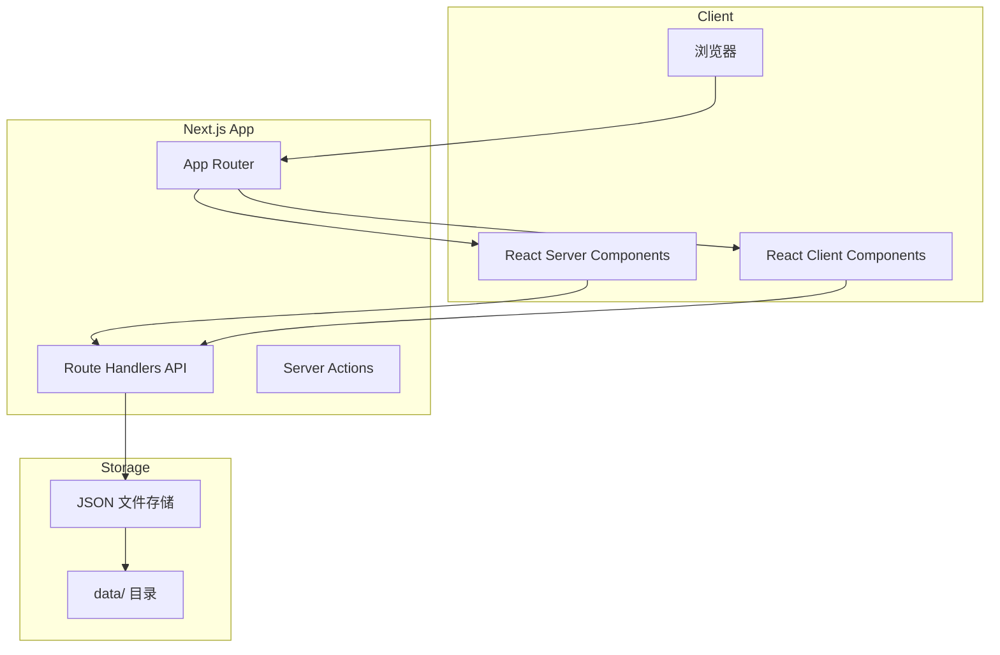
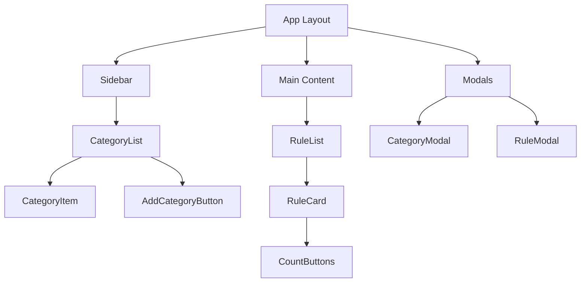

# 个人宪法 - 全栈 Web 应用开发文档

## 1. 项目概述

"个人宪法"是一个参考 Claude 宪法式 AI 思想的 Web 应用，目标是帮助用户为日常生活制定"宪法"规则，并追踪规则的遵守情况。

### 核心功能
- 规则分类管理：用户可创建分类（如"学习"、"工作"、"朋友"等）
- 规则管理：创建、编辑、删除规则，并关联到分类
- 规则计数功能：记录每条规则被遵守/违反的次数

## 2. 技术架构

### Next.js 全栈架构



### 技术栈

| 层级 | 技术 | 版本 |
|------|------|------|
| 框架 | Next.js | 16.x |
| 前端 | React | 19.x |
| 构建工具 | Next.js App Router | - |
| 语言 | TypeScript | 5.x |
| 数据存储 | JSON 文件 | - |
| 样式 | Tailwind CSS | 4.x |

## 3. 目录结构

```
personal-constitution-web/
├── app/                      # Next.js App Router 目录
│   ├── api/                  # API 路由处理程序
│   │   ├── categories/       # 分类相关 API
│   │   │   ├── route.ts      # 分类 CRUD
│   │   ├── rules/            # 规则相关 API
│   │   │   ├── route.ts      # 规则 CRUD
│   │   │   └── [id]/         # 单个规则相关
│   │   │       ├── follow/   # 遵守计数
│   │   │       └── violate/  # 违反计数
│   ├── components/           # React 组件
│   │   ├── common/           # 通用组件
│   │   ├── category/         # 分类相关组件
│   │   └── rule/             # 规则相关组件
│   ├── lib/                  # 工具函数和数据访问层
│   ├── types/                # TypeScript 类型定义
│   ├── globals.css           # 全局样式
│   ├── layout.tsx            # 根布局
│   └── page.tsx              # 首页
├── data/                     # JSON 数据存储目录
│   ├── categories.json       # 分类数据
│   ├── rules.json            # 规则数据
│   └── count-records.json    # 计数记录数据
├── docs/                     # 文档目录
├── public/                   # 静态资源
├── package.json              # 项目依赖配置
└── next.config.ts            # Next.js 配置
```

## 4. 数据模型设计

### TypeScript 接口定义

```typescript
// types/index.ts
interface Category {
  id: string;
  name: string;
  createdAt: Date;
  updatedAt: Date;
}

interface Rule {
  id: string;
  categoryId: string;
  content: string;
  followCount: number;
  violateCount: number;
  createdAt: Date;
  updatedAt: Date;
}

interface CountRecord {
  id: string;
  ruleId: string;
  type: 'follow' | 'violate';
  timestamp: Date;
  note?: string;
}
```

### JSON 文件结构示例

```json
// data/categories.json
[
  {
    "id": "cat1",
    "name": "学习",
    "createdAt": "2025-01-01T00:00:00.000Z",
    "updatedAt": "2025-01-01T00:00:00.000Z"
  },
  {
    "id": "cat2",
    "name": "工作",
    "createdAt": "2025-01-01T00:00:00.000Z",
    "updatedAt": "2025-01-01T00:00:00.000Z"
  }
]

// data/rules.json
[
  {
    "id": "rule1",
    "categoryId": "cat1",
    "content": "每天学习1小时",
    "followCount": 5,
    "violateCount": 1,
    "createdAt": "2025-01-01T00:00:00.000Z",
    "updatedAt": "2025-01-05T00:00:00.000Z"
  }
]

// data/count-records.json
[
  {
    "id": "record1",
    "ruleId": "rule1",
    "type": "follow",
    "timestamp": "2025-01-05T08:00:00.000Z",
    "note": "早上完成了学习计划"
  }
]
```

## 5. API 接口设计

### 分类 API

#### 获取所有分类
- **方法**: `GET`
- **路径**: `/api/categories`
- **响应**: `Category[]`

#### 创建分类
- **方法**: `POST`
- **路径**: `/api/categories`
- **请求体**: `{ name: string }`
- **响应**: `Category`

#### 更新分类
- **方法**: `PUT`
- **路径**: `/api/categories/{id}`
- **请求体**: `{ name: string }`
- **响应**: `Category`

#### 删除分类
- **方法**: `DELETE`
- **路径**: `/api/categories/{id}`
- **响应**: `{ success: boolean }`

### 规则 API

#### 获取所有规则（可按分类筛选）
- **方法**: `GET`
- **路径**: `/api/rules?categoryId={categoryId}`
- **响应**: `Rule[]`

#### 创建规则
- **方法**: `POST`
- **路径**: `/api/rules`
- **请求体**: `{ categoryId: string, content: string }`
- **响应**: `Rule`

#### 更新规则
- **方法**: `PUT`
- **路径**: `/api/rules/{id}`
- **请求体**: `{ content?: string }`
- **响应**: `Rule`

#### 删除规则
- **方法**: `DELETE`
- **路径**: `/api/rules/{id}`
- **响应**: `{ success: boolean }`

### 计数 API

#### 增加遵守计数
- **方法**: `POST`
- **路径**: `/api/rules/{id}/follow`
- **响应**: `{ success: boolean, rule: Rule }`

#### 增加违反计数
- **方法**: `POST`
- **路径**: `/api/rules/{id}/violate`
- **响应**: `{ success: boolean, rule: Rule }`

## 6. 组件设计

### 组件层级结构



### 核心组件说明

| 组件名 | 职责 | Props |
|--------|------|-------|
| `CategoryList` | 展示分类列表 | `categories`, `selectedCategoryId`, `onSelect`, `onEdit`, `onDelete` |
| `CategoryItem` | 单个分类项 | `category`, `isActive`, `onClick`, `onEdit`, `onDelete` |
| `RuleList` | 展示规则列表 | `rules`, `onEdit`, `onDelete`, `onCount` |
| `RuleCard` | 单条规则卡片 | `rule`, `onFollow`, `onViolate` |
| `CountButtons` | 遵守/违反按钮 | `followCount`, `violateCount`, `onFollow`, `onViolate` |
| `CategoryModal` | 分类创建/编辑弹窗 | `isOpen`, `category?`, `onSave`, `onClose` |
| `RuleModal` | 规则创建/编辑弹窗 | `isOpen`, `rule?`, `categories`, `onSave`, `onClose` |

## 7. 状态管理

### 推荐方案：React Server Components + Client Components 混合模式

- 使用 React Server Components 获取和渲染大部分数据，减少客户端 JavaScript 体积
- 在需要交互的组件中使用 Client Components
- 对于频繁更新的数据，可使用 SWR 进行客户端数据获取和缓存

### 示例 Server Component

```tsx
// app/components/category/CategoryList.tsx
import { getCategories } from '@/lib/categories';

export default async function CategoryList({
  selectedCategoryId,
  onSelect,
}: {
  selectedCategoryId: string | null;
  onSelect: (id: string) => void;
}) {
  const categories = await getCategories();
  
  return (
    <div className="category-list">
      {categories.map((category) => (
        <CategoryItem
          key={category.id}
          category={category}
          isActive={category.id === selectedCategoryId}
          onClick={() => onSelect(category.id)}
        />
      ))}
    </div>
  );
}
```

### 示例 Client Component

```tsx
// app/components/rule/CountButtons.tsx
'use client';

import { incrementFollow, incrementViolate } from '@/lib/rules';

export function CountButtons({ 
  ruleId, 
  followCount, 
  violateCount 
}: { 
  ruleId: string; 
  followCount: number; 
  violateCount: number; 
}) {
  const handleFollow = async () => {
    await incrementFollow(ruleId);
  };

  const handleViolate = async () => {
    await incrementViolate(ruleId);
  };

  return (
    <div className="count-buttons">
      <button onClick={handleFollow}>遵守 ({followCount})</button>
      <button onClick={handleViolate}>违反 ({violateCount})</button>
    </div>
  );
}
```

## 8. 开发环境配置

### 前置要求

- Node.js >= 18
- pnpm（推荐）或 npm

### 安装步骤

```bash
# 1. 克隆项目
git clone <repository-url>
cd personal-constitution-web

# 2. 安装依赖
pnpm install

# 3. 启动开发服务器
pnpm dev
```

### 开发命令

| 命令 | 说明 |
|------|------|
| `pnpm dev` | 启动 Next.js 开发服务器 |
| `pnpm build` | 构建生产版本 |
| `pnpm start` | 启动生产服务器 |
| `pnpm lint` | 运行 ESLint 检查 |

### 推荐 VSCode 插件

- Prisma
- TypeScript Vue Plugin (Volar)
- ESLint
- Prettier
- Tailwind CSS IntelliSense

## 9. 构建与部署

### 构建命令

```bash
# 构建生产版本
pnpm build
```

### 部署选项

#### Vercel (推荐)

1. 在 Vercel 中导入项目
2. 部署会自动使用 `pnpm build` 进行构建

#### 自托管

1. 构建应用：`pnpm build`
2. 运行：`pnpm start`

#### Docker 部署

```dockerfile
FROM node:18-alpine AS base
WORKDIR /app
COPY package*.json ./
RUN npm install -g pnpm
RUN pnpm install

FROM base AS production
COPY . .
RUN pnpm build

FROM base AS runtime
RUN addgroup --system --gid 1001 nodejs
RUN adduser --system --uid 1001 nextjs
USER nextjs
COPY --from=production --chown=nextjs:nodejs /app /app
WORKDIR /app
EXPOSE 3000
ENV PORT 3000
CMD ["pnpm", "start"]
```

## 10. 数据存储层实现

数据存储层位于 `lib/` 目录下，使用 Node.js 的 fs 模块读写 JSON 文件。

### 示例数据访问函数

```typescript
// lib/storage.ts
import fs from 'fs/promises';
import path from 'path';

const dataDir = path.join(process.cwd(), 'data');

// 确保数据目录存在
async function ensureDataDir() {
  await fs.mkdir(dataDir, { recursive: true });
}

// 读取 JSON 文件
export async function readJSON<T>(filename: string): Promise<T> {
  try {
    await ensureDataDir();
    const filePath = path.join(dataDir, filename);
    const data = await fs.readFile(filePath, 'utf8');
    return JSON.parse(data);
  } catch (error) {
    if ((error as NodeJS.ErrnoException).code === 'ENOENT') {
      // 文件不存在，返回空数组或空对象
      return Array.isArray([]) ? [] as unknown as T : {} as T;
    }
    throw error;
  }
}

// 写入 JSON 文件
export async function writeJSON<T>(filename: string, data: T): Promise<void> {
  await ensureDataDir();
  const filePath = path.join(dataDir, filename);
  const jsonData = JSON.stringify(data, null, 2);
  await fs.writeFile(filePath, jsonData, 'utf8');
}

// 读取分类数据
export async function getCategories() {
  return await readJSON<Category[]>('categories.json');
}

// 保存分类数据
export async function saveCategories(categories: Category[]) {
  await writeJSON('categories.json', categories);
}

// 读取规则数据
export async function getRules() {
  return await readJSON<Rule[]>('rules.json');
}

// 保存规则数据
export async function saveRules(rules: Rule[]) {
  await writeJSON('rules.json', rules);
}

// 读取计数记录数据
export async function getCountRecords() {
  return await readJSON<CountRecord[]>('count-records.json');
}

// 保存计数记录数据
export async function saveCountRecords(records: CountRecord[]) {
  await writeJSON('count-records.json', records);
}
```

这些函数提供了对 JSON 数据文件的读写操作，确保了数据的持久化存储。