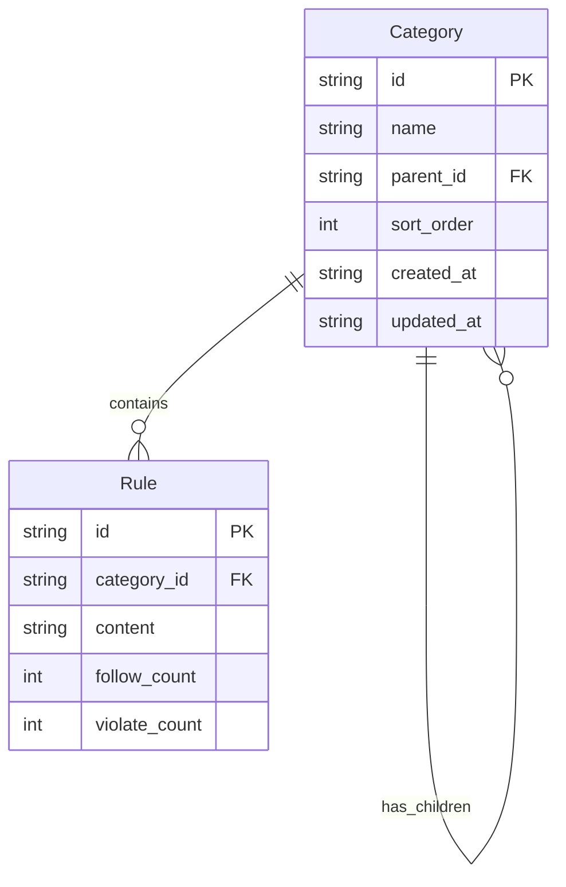
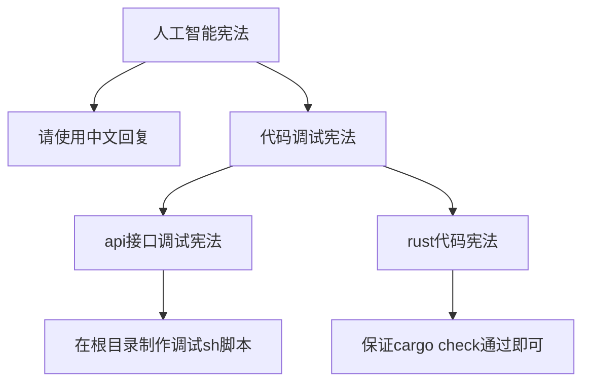

# 嵌套分类功能设计文档

## 1. 概述

本文档描述"个人宪法"项目中分类嵌套功能的设计方案。该功能允许分类形成父子关系，构建树形结构。

### 目标示例
```
人工智能宪法
├── 1. 请使用中文回复
├── 2. 代码调试宪法
│   ├── 1. api接口调试宪法
│   │   └── 1. 在根目录制作调试sh脚本
│   ├── 2. rust代码宪法
│   │   └── 1. 保证cargo check通过即可
```

---

## 2. 数据模型变更

### 2.1 Rust 模型 - [`models/mod.rs`](api/src/models/mod.rs)

**当前模型：**
```rust
pub struct Category {
    pub id: String,
    pub name: String,
    pub created_at: String,
    pub updated_at: String,
}
```

**更新后模型：**
```rust
pub struct Category {
    pub id: String,
    pub name: String,
    pub parent_id: Option<String>,  // 新增：父分类ID，None表示顶级分类
    pub sort_order: i32,            // 新增：同级排序顺序
    pub created_at: String,
    pub updated_at: String,
}
```

### 2.2 请求模型变更

**CreateCategoryRequest：**
```rust
pub struct CreateCategoryRequest {
    pub name: String,
    pub parent_id: Option<String>,  // 新增：可选的父分类ID
}
```

**UpdateCategoryRequest：**
```rust
pub struct UpdateCategoryRequest {
    pub name: String,
    pub parent_id: Option<String>,  // 新增：可选的父分类ID（用于移动分类）
    pub sort_order: Option<i32>,    // 新增：可选的排序顺序
}
```

**新增 - MoveCategoryRequest：**
```rust
pub struct MoveCategoryRequest {
    pub parent_id: Option<String>,  // 目标父分类ID，None表示移动到顶级
    pub sort_order: i32,            // 在目标位置的排序顺序
}
```

---

## 3. Protobuf 定义变更

### 3.1 更新 [`category.proto`](proto/category.proto)

```protobuf
syntax = "proto3";

package constitution;

message Category {
  string id = 1;
  string name = 2;
  optional string parent_id = 3;  // 新增：父分类ID
  int32 sort_order = 4;           // 新增：排序顺序
  string created_at = 5;
  string updated_at = 6;
}

message CategoryList {
  repeated Category categories = 1;
}

// 树形结构响应（可选，用于前端优化）
message CategoryTreeNode {
  Category category = 1;
  repeated CategoryTreeNode children = 2;
}

message CategoryTree {
  repeated CategoryTreeNode roots = 1;  // 顶级分类节点
}

message CreateCategoryRequest {
  string name = 1;
  optional string parent_id = 2;  // 新增
}

message UpdateCategoryRequest {
  string name = 1;
  optional string parent_id = 2;  // 新增
  optional int32 sort_order = 3;  // 新增
}

// 新增：移动分类请求
message MoveCategoryRequest {
  optional string parent_id = 1;
  int32 sort_order = 2;
}
```

---

## 4. API 接口变更

### 4.1 现有接口更新

| 接口 | 方法 | 变更说明 |
|------|------|----------|
| `/api/categories` | GET | 返回所有分类（平铺），包含 parent_id 字段 |
| `/api/categories` | POST | 支持 parent_id 参数创建子分类 |
| `/api/categories/{id}` | PUT | 支持更新 parent_id 和 sort_order |
| `/api/categories/{id}` | DELETE | 需要处理子分类（级联删除或阻止删除） |

### 4.2 新增接口

| 接口 | 方法 | 说明 |
|------|------|------|
| `/api/categories/tree` | GET | 返回树形结构的分类数据 |
| `/api/categories/{id}/children` | GET | 获取指定分类的直接子分类 |
| `/api/categories/{id}/move` | POST | 移动分类到新的父分类下 |

### 4.3 接口详细设计

#### GET /api/categories/tree
返回完整的分类树结构，便于前端一次性获取并渲染。

**响应示例：**
```json
{
  "roots": [
    {
      "category": {
        "id": "uuid-1",
        "name": "人工智能宪法",
        "parent_id": null,
        "sort_order": 0
      },
      "children": [
        {
          "category": {
            "id": "uuid-2",
            "name": "代码调试宪法",
            "parent_id": "uuid-1",
            "sort_order": 1
          },
          "children": [...]
        }
      ]
    }
  ]
}
```

#### POST /api/categories/{id}/move
移动分类到新的位置。

**请求体：**
```json
{
  "parent_id": "uuid-target-parent",  // null 表示移动到顶级
  "sort_order": 2
}
```

**业务规则：**
- 不能将分类移动到自己的子分类下（防止循环引用）
- 移动后自动调整同级其他分类的 sort_order

---

## 5. 前端类型定义变更

### 5.1 更新 [`types/index.ts`](app/types/index.ts)

```typescript
export interface Category {
  id: string;
  name: string;
  parent_id: string | null;  // 新增
  sort_order: number;        // 新增
  created_at: string;
  updated_at: string;
}

// 新增：树形节点结构
export interface CategoryTreeNode {
  category: Category;
  children: CategoryTreeNode[];
}

// 新增：分类树
export interface CategoryTree {
  roots: CategoryTreeNode[];
}

// 新增：创建分类请求
export interface CreateCategoryRequest {
  name: string;
  parent_id?: string;
}

// 新增：移动分类请求
export interface MoveCategoryRequest {
  parent_id: string | null;
  sort_order: number;
}
```

### 5.2 前端工具函数

```typescript
// 将平铺的分类列表转换为树形结构
function buildCategoryTree(categories: Category[]): CategoryTreeNode[] {
  const map = new Map<string, CategoryTreeNode>();
  const roots: CategoryTreeNode[] = [];

  // 创建所有节点
  categories.forEach(cat => {
    map.set(cat.id, { category: cat, children: [] });
  });

  // 构建树形关系
  categories.forEach(cat => {
    const node = map.get(cat.id)!;
    if (cat.parent_id && map.has(cat.parent_id)) {
      map.get(cat.parent_id)!.children.push(node);
    } else {
      roots.push(node);
    }
  });

  // 按 sort_order 排序
  const sortNodes = (nodes: CategoryTreeNode[]) => {
    nodes.sort((a, b) => a.category.sort_order - b.category.sort_order);
    nodes.forEach(n => sortNodes(n.children));
  };
  sortNodes(roots);

  return roots;
}
```

---

## 6. 数据结构示意图



## 7. 树形结构示意图



---

## 8. 实现注意事项

### 8.1 后端实现

1. **数据迁移**：现有分类数据需要添加 `parent_id: null` 和 `sort_order: 0`
2. **循环引用检测**：移动分类时必须检测是否会形成循环
3. **级联删除策略**：
   - 方案A：删除父分类时，子分类提升为顶级分类
   - 方案B：删除父分类时，级联删除所有子分类和规则
   - **建议采用方案B**，更符合直觉
4. **排序维护**：插入/移动分类时自动调整同级 sort_order

### 8.2 前端实现

1. **组件改造**：[`CategoryList.tsx`](app/components/category/CategoryList.tsx) 需要支持递归渲染
2. **缩进显示**：子分类需要有视觉缩进，建议每级缩进 16-24px
3. **展开/折叠**：支持折叠子分类以简化视图
4. **拖拽排序**：可选功能，支持拖拽调整分类顺序和层级

### 8.3 API 客户端更新

[`api-client.ts`](app/lib/api-client.ts) 需要新增：
- `getCategoryTree()` - 获取树形结构
- `createCategory(name, parentId?)` - 支持父分类参数
- `moveCategory(id, parentId, sortOrder)` - 移动分类

### 8.4 数据存储

[`categories.json`](api/data/categories.json) 格式更新示例：
```json
[
  {
    "id": "uuid-1",
    "name": "人工智能宪法",
    "parent_id": null,
    "sort_order": 0,
    "created_at": "...",
    "updated_at": "..."
  },
  {
    "id": "uuid-2",
    "name": "代码调试宪法",
    "parent_id": "uuid-1",
    "sort_order": 1,
    "created_at": "...",
    "updated_at": "..."
  }
]
```

---

## 9. 测试脚本

根据 AGENTS.md 规范，需要在根目录创建调试脚本：

**test-category-tree.sh：**
```bash
#!/bin/bash
API_BASE="http://localhost:8080/api"

# 创建顶级分类
echo "=== 创建顶级分类 ==="
curl -X POST "$API_BASE/categories" \
  -H "Content-Type: application/json" \
  -d '{"name": "人工智能宪法"}'

# 创建子分类
echo "\n=== 创建子分类 ==="
curl -X POST "$API_BASE/categories" \
  -H "Content-Type: application/json" \
  -d '{"name": "代码调试宪法", "parent_id": "<parent_id>"}'

# 获取分类树
echo "\n=== 获取分类树 ==="
curl "$API_BASE/categories/tree"

# 移动分类
echo "\n=== 移动分类 ==="
curl -X POST "$API_BASE/categories/<id>/move" \
  -H "Content-Type: application/json" \
  -d '{"parent_id": null, "sort_order": 0}'
```

---

## 10. 实现步骤建议

1. 更新 Protobuf 定义
2. 更新 Rust 数据模型
3. 更新存储层函数
4. 实现新的 API 接口
5. 更新前端类型定义
6. 更新 API 客户端
7. 改造分类列表组件支持树形渲染
8. 创建测试脚本
9. 数据迁移（为现有数据添加新字段）
