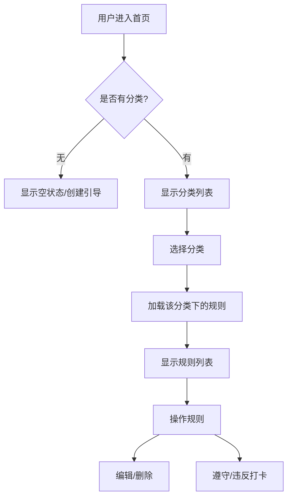

# 功能树.md

## 1. 功能目录
- 分类管理
  - 创建分类
  - 编辑分类
  - 删除分类
  - 查看分类列表
- 规则管理
  - 创建规则
  - 编辑规则
  - 删除规则
  - 查看规则列表
  - 遵守规则打卡
  - 违反规则打卡

## 2. 核心功能实现流程图

## 3. 核心功能实现文字说明
用户通过左侧侧边栏管理分类，点击分类后在右侧主区域显示对应的规则列表。每个规则卡片上可以直接进行遵守或违反的计数操作。

## 4. 子功能实现流程图（按需补充）
暂无复杂逻辑。

## 5. 子功能实现文字说明
- **分类管理**: 通过 API 与后端交互，增删改查分类数据。
- **规则管理**: 依赖于选中的分类 ID，增删改查规则数据。
- **打卡**: 简单的计数器增加操作。

## 6. 数据结构
- **Category**: `{ id: string, name: string }`
- **Rule**: `{ id: string, category_id: string, content: string, follow_count: number, violate_count: number }`
